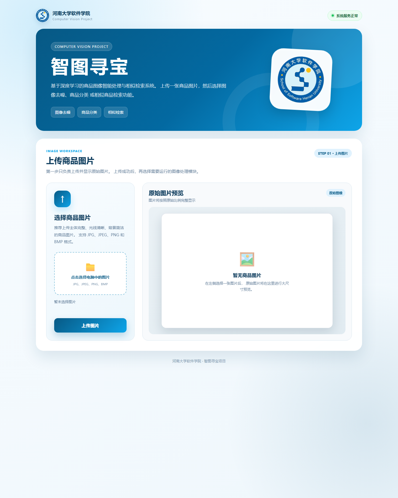
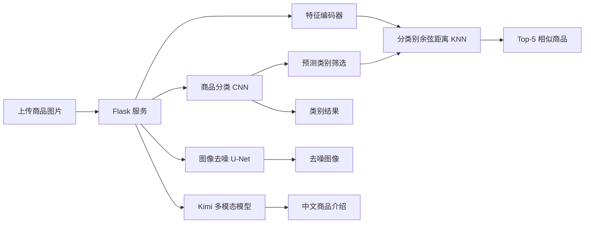

# ✨ 智图寻宝 · Shop Vision

<p align="center">
  
</p>

<p align="center">
  <a href="https://github.com/lizhuofan-curry/smart-image-treasure-hunt/actions/workflows/ci.yml"></a>
  
  
  
  
  
</p>

<p align="center"><b>🛍️ 商品分类 · ✨ 图像去噪 · 🔎 相似检索 · 🤖 AI 商品文案</b></p>

“智图寻宝”是一个面向商品图片场景的 AI 视觉应用。一次上传，完成从**看懂图片**到**生成可读结论**的闭环：识别商品类别、恢复带噪图像、检索相似商品，并借助 Kimi 多模态模型生成克制可靠的中文商品介绍。

它关注的不只是“训练出一个模型”，还将**数据准备、模型权重、特征库、Web 推理、LLM 调用与结果呈现**串成完整闭环：分类回答“它是什么”，去噪改善“看得是否清楚”，检索回答“与哪些商品相似”，AI 文案则把视觉信息转换为用户可读的描述。

## 🏷️ 项目标签

`computer-vision` `deep-learning` `pytorch` `flask` `image-classification` `image-denoising` `image-retrieval` `autoencoder` `knn` `fashion`

## 🖥️ 网页界面

下图为本地 Flask 服务的 CV 主工作区截图，展示统一上传入口以及商品分类、图像去噪和相似商品检索。当前代码还提供 AI 商品介绍功能；该功能加入时间晚于这张截图，因此截图不代表当前页面的全部功能。

<p align="center">
  
</p>

<p align="center"><sub>Flask CV 主工作区：图片上传区、三类本地视觉任务入口与实时服务状态</sub></p>

## 💡 核心亮点

| 从算法到应用 | 项目中的落地方式 |
| --- | --- |
| 一图四用 | 同一上传入口支持分类、去噪、相似检索和 AI 商品介绍，无需切换脚本。 |
| 多尺度细节恢复 | 去噪网络在解码阶段拼接编码器特征，让局部纹理与高层语义共同参与图像恢复。 |
| 类别感知检索 | 分类模型先确定商品类别，KNN 再从同类别特征子库中搜索，减少跨类别相似结果。 |
| 可检索的视觉表达 | 编码器将 64 × 64 RGB 图像映射到 1024 维向量，并通过余弦距离对同类别候选排序。 |
| 可维护的工程结构 | 训练、测试、配置、推理服务按模块拆分，路径与超参数集中管理。 |
| 可验证的交付 | 随机种子、Git LFS 模型资产、模型前向测试、模拟检索测试和 Flask 上传测试共同支撑持续检查。 |

## 🚀 本次更新优势

- **视觉结果更易理解**：新增 AI 商品介绍。Kimi 多模态模型会基于上传图片生成 150 字以内的中文描述，并通过受约束提示词避免编造品牌、价格、材质与性能参数。
- **分类训练兼顾少数类别**：根据训练集类别数量自动计算交叉熵权重，降低多数类别“上衣”对梯度的主导作用。当前最佳权重在 6214 张验证图片上达到 `99.32%` 准确率、`99.04%` 宏平均 F1；“下身衣服”召回率为 `97.92%`。这些数值均为验证集指标，不是独立测试集结果。
- **分类与检索形成级联**：相似检索会先调用分类模型，再在预测类别对应的 KNN 子库中搜索。页面同步展示检索类别、分类置信度和每个候选商品的类别。
- **工作流更完整**：同一张已上传图片可连续用于分类、去噪、类别感知检索和文案生成，用户不需要在不同页面或脚本之间重复操作。
- **去噪训练更充分**：本地配置训练 100 轮，并保存验证集损失最低的权重；当前训练日志中的最佳验证损失为 `0.008605`。该数值是验证集损失，不是独立测试集指标。
- **配置更安全、交付更干净**：Kimi 密钥通过本地 `kimi.env` 配置并被忽略规则保护；上传图和处理结果属于运行时产物，不会进入版本库。

## 🧠 功能一览

| 模块 | 实现方式 | 用户可见结果 |
| --- | --- | --- |
| 商品分类 | 4 个卷积块（16 → 32 → 64 → 128）+ 全局平均池化 + 类别加权交叉熵 | 上衣、鞋、包、下身衣服、手表 5 类预测与 Softmax 概率 |
| 图像去噪 | 带跳跃连接的轻量 U-Net 风格卷积自编码器 | 固定强度混合噪声下的去噪图像 |
| 相似商品检索 | 分类引导、5 层卷积编码器、1024 维嵌入、分类别余弦距离 KNN | 同类别 Top-5 商品、距离、相似度与类别 |
| AI 商品文案 | Kimi 多模态视觉 API + 受约束提示词 | 基于可见信息的 150 字内中文商品介绍 |
| Web 服务 | Flask + HTML/CSS/JavaScript | 上传、推理、结果展示的一体化页面 |

## 🔄 系统流程



## 🗂️ 项目结构

```text
.
├── common/
│   ├── dataset/                    # 本地商品图片目录（不随仓库分发）
│   ├── fashion-labels.csv          # 分类标签
│   └── utils.py                    # 随机种子与自然排序工具
├── image_classification/           # 分类数据、CNN、训练、测试、权重
├── image_denoising/                # 去噪数据、U-Net、训练、测试、权重
├── image_similarity/               # 自编码器、嵌入库、KNN 检索、权重
├── web/                            # Flask 入口、服务层、前端页面
├── tests/                          # 模型、检索、Web 与 LFS 资产烟雾测试
├── docs/assets/                    # README 演示素材
├── .github/workflows/ci.yml        # 语法、结构、模型与 Web 自动检查
├── .gitattributes                  # Git LFS 规则
└── requirements.txt
```

## 🚀 快速开始

### 1. 克隆并获取模型大文件

模型权重和特征库通过 Git LFS 管理。请先安装 [Git LFS](https://git-lfs.com/)，再执行：

```bash
git clone https://github.com/lizhuofan-curry/smart-image-treasure-hunt.git
cd smart-image-treasure-hunt
git lfs pull
```

### 2. 准备数据集

当前仓库**没有分发 `common/dataset.zip`**。请从具有合法使用权限的原始来源取得商品图片，并将图片放入 `common/dataset/`。

当前 `fashion-labels.csv` 和 `embeddings.npy` 均与本地数据集按自然排序后的图片一一对应。若替换、增删或重命名图片，必须同步更新标签并重新生成特征库，否则分类标签和检索结果会发生错位。

公开发布数据集前，还应补充原始来源、下载地址、预处理过程和再分发许可；在这些信息确认前，不应把本地图片打包上传到公开仓库。

### 3. 安装 Python 依赖

```bash
python -m venv .venv
# Windows PowerShell
.venv\Scripts\Activate.ps1
pip install -r requirements.txt
```

若使用 GPU，请从 [PyTorch 官网](https://pytorch.org/get-started/locally/) 安装与你的 CUDA 环境匹配的 `torch` 与 `torchvision`。

### 4. 配置 Kimi 多模态能力（可选）

在项目根目录创建仅保存在本地的 `kimi.env`：

```env
MOONSHOT_API_KEY=你的_Kimi_API_Key
```

该文件已被 `.gitignore` 排除，**不要提交、截图或分享其中的密钥**。未配置时，分类、去噪与检索模块仍可使用；仅 AI 商品文案不可用。

### 5. 启动应用

```bash
python -m web.web_app
```

打开 <http://127.0.0.1:9001>，上传 JPG、JPEG、PNG 或 BMP 图片（最大 10 MB），再选择“商品分类”“图像去噪”“相似商品”或“AI 商品介绍”。

### 🩺 启动前自检

若页面启动时报找不到文件，请按下表检查：

| 现象 | 优先检查 |
| --- | --- |
| 找不到图片目录 | 是否已按数据使用许可准备 `common/dataset/` |
| 分类或去噪服务加载失败 | 对应的 `classifier.pth` 或 `denoiser.pth` 是否已被 Git LFS 拉取 |
| 相似检索加载失败 | `encoder.pth`、`embeddings.npy` 与图片数据集是否同时存在 |
| LFS 文件显示为文本指针 | 在仓库根目录执行 `git lfs install` 和 `git lfs pull` |

## 📦 模型与数据资产

| 文件 | 用途 | 版本管理 |
| --- | --- | --- |
| `common/dataset/` | 本地商品图片目录 | 不随仓库分发 |
| `common/fashion-labels.csv` | 本地数据集对应的分类标签 | Git |
| `image_classification/classifier.pth` | 5 类分类模型 | Git LFS |
| `image_denoising/denoiser.pth` | 图像去噪模型 | Git LFS |
| `image_similarity/encoder.pth` | 相似检索特征编码器 | Git LFS |
| `image_similarity/decoder.pth` | 自编码器训练时的解码器 | Git LFS |
| `image_similarity/embeddings.npy` | 全量商品的 1024 维特征库 | Git LFS |

## 📄 数据与许可

- 当前仓库未记录商品图片数据集的原始来源和再分发许可，因此只保留标签、模型和特征资产，不公开分发本地图片。
- 在公开答辩材料或进一步发布前，应补充数据来源链接、许可类型、筛选规则、类别映射和去重过程。
- 项目根目录当前也没有开源许可证；在明确代码发布范围后，可选择合适的许可证并增加 `LICENSE` 文件。

## 🛠️ 工程实践

- **输入安全**：仅接受图片格式，单文件限制为 10 MB；服务端保存时使用 UUID，避免同名覆盖。
- **可复现性**：固定 Python、NumPy、PyTorch 与 cuDNN 的随机性，并将训练超参数集中到各模块配置文件。
- **模型复用**：Flask 启动时加载推理服务；相似检索在启动阶段同时构建完整 KNN 和 5 个分类别 KNN 子索引，查询阶段直接复用。
- **持续集成**：每次推送至 `main` 或提交 Pull Request 时，GitHub Actions 会编译全部 Python 模块，运行三个模型的前向测试、1024 维模拟 KNN 检索、状态字典读写、Flask 上传测试和分类引导检索路由测试。
- **真实资产核验**：手动触发 GitHub Actions 时会拉取 Git LFS 文件，检查四份模型权重是否匹配当前网络结构，并确认特征库为二维且特征维度为 1024。

## 🏆 项目成果与材料

- **可运行应用**：三个本地视觉模块和可选 AI 商品介绍已接入同一 Flask 页面，默认监听 `127.0.0.1:9001`。
- **分类验证结果**：最佳分类权重在固定验证集上的准确率为 `99.32%`、宏平均 F1 为 `99.04%`；529 张下身衣服中正确识别 518 张，其中 9 张被判为上衣。
- **检索策略升级**：相似检索不再直接搜索完整商品库，而是使用分类结果选择同类别特征子库，再按照余弦距离返回 Top-5。
- **模型交付资产**：分类、去噪、检索模型权重与检索特征库由 Git LFS 管理；本地商品图片因来源和许可尚未记录，不随仓库分发。
- **真实演示材料**：`docs/assets/web-home-full.png` 为本地 Flask CV 主工作区截图，拍摄时间早于 AI 商品介绍和分类引导检索功能。
- **补充证明材料**：如需添加课程证书、获奖证明或项目答辩材料，请置于 `docs/certificates/`，并在本节追加来源和说明。

## 🗺️ 路线图

- [x] 三个 CV 模块的统一 Web 入口
- [x] Git LFS 大文件管理与基础 CI
- [x] README 网页界面展示与复现说明
- [x] 增加模型前向、模拟检索、Flask 上传与手动 LFS 资产兼容性测试
- [x] 增加类别加权训练与分类引导的同类别 KNN 检索
- [ ] 补充商品图片数据来源、处理流程和使用许可
- [ ] 更新包含 AI 商品介绍功能的完整网页截图
- [ ] 容器化（Docker）并接入可选部署目标
- [ ] 配置 CD：镜像构建、部署及健康检查
- [ ] 补充更多真实的分类和相似检索演示样例

## 🔧 技术栈

Python · PyTorch · Torchvision · Flask · Pillow · NumPy · Pandas · scikit-learn · HTML/CSS/JavaScript · GitHub Actions · Git LFS

## 📌 说明

README 对模型结构、损失函数和检索方式均以仓库当前代码为准；训练日志中的验证损失不是独立测试集成绩。网页截图用于说明交互界面，不应被解读为模型精度、检索延迟或泛化能力的量化结论。
