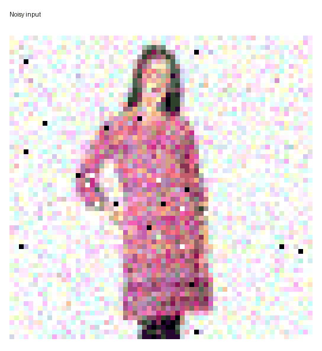
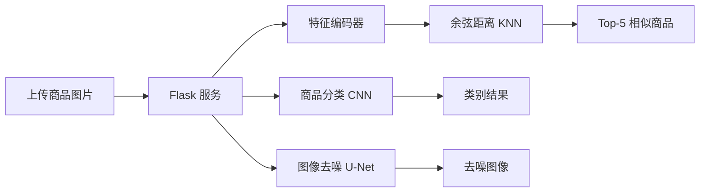

# 智图寻宝 · Shop Vision

<p align="center">
  
</p>

<p align="center">
  <a href="https://github.com/lizhuofan-curry/smart-image-treasure-hunt/actions/workflows/ci.yml"></a>
  
  
  
  
</p>

<p align="center"><b>商品图像分类 · 图像去噪 · 相似商品检索</b></p>

“智图寻宝”是一个面向商品图片场景的计算机视觉综合实践项目。它将三条独立的 PyTorch 推理链路接入同一个 Flask 网页：上传一张图片，即可完成商品类别判断、带噪图像恢复，或从商品图库中找出最相近的 5 件商品。

## 项目标签

`computer-vision` `deep-learning` `pytorch` `flask` `image-classification` `image-denoising` `image-retrieval` `autoencoder` `knn` `fashion`

## 运行效果

下图为本项目网页实际生成的一组去噪结果，GIF 在“加噪输入”和“模型去噪输出”之间循环切换；它是展示素材，不代表定量评测指标。

<p align="center">
  
</p>

## 功能一览

| 模块 | 实现方式 | 用户可见结果 |
| --- | --- | --- |
| 商品分类 | 4 个卷积块（16 → 32 → 64 → 128）+ 全局平均池化 | 上衣、鞋、包、下身衣服、手表 5 类预测 |
| 图像去噪 | 带跳跃连接的轻量 U-Net 风格卷积自编码器 | 固定强度混合噪声下的去噪图像 |
| 相似商品检索 | 5 层卷积编码器、1024 维嵌入、余弦距离 KNN | Top-5 相似商品、距离与相似度 |
| Web 服务 | Flask + HTML/CSS/JavaScript | 上传、推理、结果展示的一体化页面 |

## 系统流程



## 项目结构

```text
.
├── common/
│   ├── dataset.zip                 # 商品图片数据集（Git LFS）
│   ├── fashion-labels.csv          # 分类标签
│   └── utils.py                    # 随机种子与自然排序工具
├── image_classification/           # 分类数据、CNN、训练、测试、权重
├── image_denoising/                # 去噪数据、U-Net、训练、测试、权重
├── image_similarity/               # 自编码器、嵌入库、KNN 检索、权重
├── web/                            # Flask 入口、服务层、前端页面
├── docs/assets/                    # README 演示素材
├── .github/workflows/ci.yml        # 自动语法与项目结构检查
├── .gitattributes                  # Git LFS 规则
└── requirements.txt
```

## 快速开始

### 1. 克隆并获取大文件

数据集、模型权重和特征库通过 Git LFS 管理。请先安装 [Git LFS](https://git-lfs.com/)，再执行：

```bash
git clone https://github.com/lizhuofan-curry/smart-image-treasure-hunt.git
cd smart-image-treasure-hunt
git lfs pull
```

### 2. 解压数据集

```bash
python -c "import zipfile; zipfile.ZipFile('common/dataset.zip').extractall('common')"
```

解压后应存在 `common/dataset/`。相似检索的 `embeddings.npy` 与该目录按自然排序的图片一一对应，请勿替换或打乱图片顺序。

### 3. 安装 Python 依赖

```bash
python -m venv .venv
# Windows PowerShell
.venv\Scripts\Activate.ps1
pip install -r requirements.txt
```

若使用 GPU，请从 [PyTorch 官网](https://pytorch.org/get-started/locally/) 安装与你的 CUDA 环境匹配的 `torch` 与 `torchvision`。

### 4. 启动应用

```bash
python -m web.web_app
```

打开 <http://127.0.0.1:9000>，上传 JPG、JPEG、PNG 或 BMP 图片（最大 10 MB），再选择“商品分类”“图像去噪”或“相似商品”。

## 模型与数据资产

| 文件 | 用途 | 版本管理 |
| --- | --- | --- |
| `common/dataset.zip` | 商品图片数据集压缩包 | Git LFS |
| `image_classification/classifier.pth` | 5 类分类模型 | Git LFS |
| `image_denoising/denoiser.pth` | 图像去噪模型 | Git LFS |
| `image_similarity/encoder.pth` | 相似检索特征编码器 | Git LFS |
| `image_similarity/decoder.pth` | 自编码器训练时的解码器 | Git LFS |
| `image_similarity/embeddings.npy` | 全量商品的 1024 维特征库 | Git LFS |

## 工程实践

- **输入安全**：仅接受图片格式，单文件限制为 10 MB；服务端保存时使用 UUID，避免同名覆盖。
- **可复现性**：固定 Python、NumPy、PyTorch 与 cuDNN 的随机性，并将训练超参数集中到各模块配置文件。
- **模型复用**：Flask 启动时加载推理服务；相似检索在启动阶段构建 KNN 索引，查询阶段直接复用。
- **持续集成**：每次推送至 `main` 或提交 Pull Request 时，GitHub Actions 会编译全部 Python 模块并核验关键项目文件。

## CI/CD 计划

当前已启用 CI。CD 需要明确部署目标（例如 Hugging Face Spaces、Render、Docker 或云服务器）及模型文件的安全存储方式后才能可靠接入；届时可在此基础上增加镜像构建、部署与健康检查工作流。

## 成果与证书

本仓库当前收录的是可运行源码、真实演示素材与模型资产。尚未发现可核验的个人证书文件，因此没有虚构展示；如需补充，可将原件放入 `docs/certificates/` 后在此处添加链接和说明。

## 技术栈

Python · PyTorch · Torchvision · Flask · Pillow · NumPy · Pandas · scikit-learn · HTML/CSS/JavaScript · GitHub Actions · Git LFS

## 说明

README 对模型结构、损失函数和检索方式均以仓库当前代码为准；演示 GIF 展示的是一次真实的网页去噪输出，不应被解读为模型精度、检索延迟或泛化能力的量化结论。
